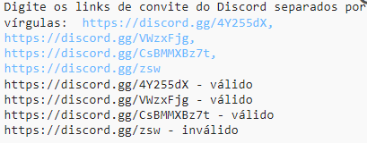
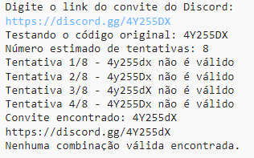
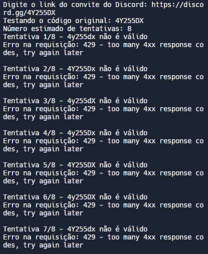

# DC Server Link Check [](https://github.com/e43b/DC-Server-Link-Check/)

###### [English](README.md) | [Português](README-ptbr.md)

[](https://oxapay.com/donate/40874860)
[](https://discord.gg/CsBMMXBz7t)

**GitHub Project**: [DC Server Link Check](https://github.com/e43b/DC-Server-Link-Check/)
**Author**: [e43b](https://github.com/e43b)

## Description

The **DC Server Link Check** project is a tool for checking Discord server invite links and also for finding links that are written incorrectly.

**Important Note**: Excessive use of this tool may lead to temporary or permanent IP bans. Therefore, it is not recommended for general use except in specific situations.

## Installation

1. Clone the repository:
   ```sh
   git clone https://github.com/e43b/DC-Server-Link-Check.git
   ```
2. Navigate to the project directory:
   ```sh
   cd DC-Server-Link-Check
   ```
3. Install the dependencies:
   ```sh
   pip install -r requirements.txt
   ```

## Features

### Check Invite

The `checkinvite/codeen.py` script allows you to verify whether Discord invite links are valid or invalid.

#### How to Use

To check the validity of Discord invite links:
```sh
python checkinvite/codeen.py
```

1. Run the script.
2. Enter the invite link or links separated by commas.
3. The script will check each link against the Discord API and return whether it is valid or invalid.



### Link Finder

The `findinvite/codeen.py` tool attempts to find incorrectly written Discord invite links. If you have a link with correct characters but incorrect capitalization, this script can help.

#### How to Use

To find incorrectly written Discord invite links:
```sh
python findinvite/codeen.py
```

1. Run the script.
2. Enter the Discord invite link.
3. The script will generate all possible combinations of uppercase and lowercase letters and test each one against the API until it finds the correct link.



**Note**: This tool may cause IP bans due to a high number of requests, resulting in a 429 error (too many requests in a short period). The script has a 1-second cooldown between requests, but continuous usage or a high number of attempts may still cause bans.



## Donations

If you find this project useful, consider making a donation to support its development: [Donate via Oxapay](https://oxapay.com/donate/40874860).

## Community

Join our Discord server to discuss this project and get support: [Discord Server](https://discord.gg/CsBMMXBz7t).

**Note**: Always use these tools responsibly and within the Discord usage policies.
